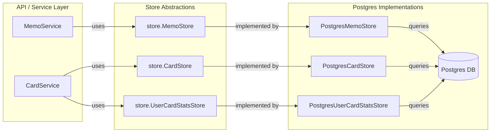

# Implement MemoStore and CardStore Interfaces and Postgres Implementations

## chosen approach (one-liner)

Implement clean, focused Postgres-backed `MemoStore` and `CardStore` adhering to domain-driven interface contracts, leveraging strict separation, explicit transaction handling, and rigorous validation, with exhaustive test coverage and structured logging.

## architecture blueprint

### **modules / packages**

- `internal/store`
  - **Responsibility:** Defines persistence interfaces for domain objects (Memo, Card, UserCardStats). Pure abstractions; no DB details.
- `internal/platform/postgres`
  - **Responsibility:** Implements the persistence interfaces for Postgres. Handles DB connections, queries, mapping, error translation, logging. No business logic.
- `internal/domain`
  - **Responsibility:** Pure domain models, validation, invariants.
- `internal/testutils`
  - **Responsibility:** DB test helpers; transaction isolation.

### **public interfaces / contracts**

**From `internal/store`** (signature sketches):

```go
// MemoStore defines the interface for memo data persistence.
type MemoStore interface {
    // Create saves a new memo to the store.
    Create(ctx context.Context, memo *domain.Memo) error
    // GetByID retrieves a memo by its unique ID. Returns ErrNotFound if not found.
    GetByID(ctx context.Context, id uuid.UUID) (*domain.Memo, error)
    // UpdateStatus updates the status of an existing memo. Returns ErrNotFound if not found.
    UpdateStatus(ctx context.Context, id uuid.UUID, status domain.MemoStatus) error
    // FindMemosByStatus retrieves memos matching a specific status.
    FindMemosByStatus(ctx context.Context, status domain.MemoStatus) ([]*domain.Memo, error)
}

// CardStore defines the interface for card data persistence.
type CardStore interface {
    // CreateMultiple saves multiple new cards and their initial stats atomically.
    // It performs a batch insert for efficiency.
    CreateMultiple(ctx context.Context, cards []*domain.Card, initialStats []*domain.UserCardStats) error
    // GetByID retrieves a card by its unique ID. Returns ErrNotFound if not found.
    GetByID(ctx context.Context, id uuid.UUID) (*domain.Card, error)
    // UpdateContent updates the content JSONB of an existing card. Returns ErrNotFound if not found.
    UpdateContent(ctx context.Context, id uuid.UUID, content json.RawMessage) error
    // Delete removes a card and its associated stats. Returns ErrNotFound if not found.
    Delete(ctx context.Context, id uuid.UUID) error
    // GetNextReviewCard retrieves the next card due for review for a specific user.
    // Returns ErrNotFound if no cards are due.
    // NOTE: Detailed implementation is part of a future task (Card Review API)
    GetNextReviewCard(ctx context.Context, userID uuid.UUID, now time.Time) (*domain.Card, error)
}

// UserCardStatsStore defines the interface for user card statistics persistence.
type UserCardStatsStore interface {
    // Get retrieves the stats for a specific user and card. Returns ErrNotFound if not found.
    Get(ctx context.Context, userID, cardID uuid.UUID) (*domain.UserCardStats, error)
    // Update saves changes to existing stats. Returns ErrNotFound if not found.
    Update(ctx context.Context, stats *domain.UserCardStats) error
    // Delete removes the stats for a specific user and card. Returns ErrNotFound if not found.
    Delete(ctx context.Context, userID, cardID uuid.UUID) error
}
```

**Postgres implementations in `internal/platform/postgres`:**

```go
type PostgresMemoStore struct {
    db store.DBTX
    logger *slog.Logger
}

type PostgresCardStore struct {
    db store.DBTX
    logger *slog.Logger
}

type PostgresUserCardStatsStore struct {
    db store.DBTX
    logger *slog.Logger
}
```

### **data flow diagram**



### **error & edge-case strategy**

- All methods return domain-meaningful errors (`ErrNotFound`, `ErrDuplicate`, domain validation errors) – never leak SQL errors.
- Map `sql.ErrNoRows` to `store.ErrNotFound` for all Get/Update/Delete operations.
- Map PostgreSQL constraint violations to appropriate domain errors (e.g., unique constraint to `ErrDuplicate`).
- Validate all inputs (UUIDs, struct validity) before DB operations.
- Use transactions for batch operations (`CreateMultiple`), with rollback on any error.
- For batch errors, use atomic transactions - fail the entire operation if any item fails.
- Handle concurrent modification with optimistic concurrency if needed.

## detailed build steps

1. **Define or finalize interfaces in `internal/store`:**
   - Define `MemoStore`, `CardStore`, `UserCardStatsStore` interfaces with precise contracts.
   - Document error semantics (what `ErrNotFound` means, etc.).

2. **Implement `PostgresMemoStore` in `internal/platform/postgres/memo_store.go`:**
   - Create struct with `db store.DBTX` and `logger *slog.Logger`.
   - Implement constructor `NewPostgresMemoStore`.
   - Implement `Create` using parameterized SQL INSERT.
   - Implement `GetByID` using SELECT, mapping `sql.ErrNoRows` to `store.ErrNotFound`.
   - Implement `UpdateStatus` using UPDATE with status parameter.
   - Implement `FindMemosByStatus` using SELECT with status filter.

3. **Implement `PostgresCardStore` in `internal/platform/postgres/card_store.go`:**
   - Create struct with `db store.DBTX` and `logger *slog.Logger`.
   - Implement constructor `NewPostgresCardStore`.
   - Implement `CreateMultiple` using a transaction and efficient batch insertion (`pgx.CopyFrom` where possible).
   - Implement `GetByID` using SELECT with JSONB handling.
   - Implement `UpdateContent` for updating just the content field.
   - Implement `Delete` to remove a card and rely on CASCADE for stats.
   - Implement stub for `GetNextReviewCard` (return `ErrNotImplemented`).

4. **Implement `PostgresUserCardStatsStore` in `internal/platform/postgres/user_card_stats_store.go`:**
   - Create struct with `db store.DBTX` and `logger *slog.Logger`.
   - Implement constructor `NewPostgresUserCardStatsStore`.
   - Implement `Get` to retrieve stats for a user/card pair.
   - Implement `Update` for modifying existing stats.
   - Implement `Delete` for removing stats if needed.

5. **Implement error mapping and validation:**
   - Map `sql.ErrNoRows` to `store.ErrNotFound`.
   - Map unique constraint violations to `store.ErrDuplicate`.
   - Add appropriate error wrapping with context.
   - Validate UUIDs, status enums, JSON content before DB operations.
   - Use parameterized queries exclusively to prevent SQL injection.

6. **Add structured logging:**
   - Log method entry/exit at DEBUG level.
   - Log mutations (create/update/delete) at INFO level with entity IDs.
   - Log errors at ERROR level with detailed context.
   - Include correlation ID from context where available.

7. **Add comprehensive tests:**
   - Integration tests using `testutils.WithTx` for database isolation.
   - Test success cases, not found cases, and error paths.
   - Test batch operations and transactions.
   - Test correct field mapping for complex types (JSONB, enums).

8. **Add documentation:**
   - Add GoDoc comments to all interfaces and implementations.
   - Update READMEs if needed.
   - Add inline documentation for complex SQL or business rules.

9. **Update main.go for dependency injection:**
   - Update the main application setup to wire in the new stores.

## testing strategy

- **Test Layers:**
  - **Integration Tests:** Test all database operations against a real Postgres instance in transaction isolation using `testutils.WithTx`.
  - No unit tests needed as the core logic is in SQL operations against a real database.

- **What to mock:**
  - Do not mock internal collaborators.
  - Use real Postgres for all tests through `testutils.WithTx`.
  - The `store.DBTX` interface provides transaction support for test isolation.

- **Coverage targets & edge-case notes:**
  - 100% of interface contracts and error paths should be covered.
  - Test all operations for success, not found, and error conditions.
  - Test batch operations for atomicity.
  - Test enum mapping, UUID handling, and JSONB fields.
  - Test foreign key relationships (e.g., cascade delete).

## logging & observability

- **Log events + structured fields per action:**
  - Method entry: `level=DEBUG`, `component="PostgresMemoStore"`, `method="Create"`, `memo_id=X`, `user_id=Y`
  - Success: `level=INFO`, `component="PostgresMemoStore"`, `method="Create"`, `memo_id=X`, `user_id=Y`, `duration_ms=Z`
  - Error: `level=ERROR`, `component="PostgresMemoStore"`, `method="Create"`, `memo_id=X`, `user_id=Y`, `error="detailed message"`
  - Not found: `level=DEBUG`, `component="PostgresMemoStore"`, `method="GetByID"`, `memo_id=X`, `error="not found"`

- **Correlation id propagation:**
  - Extract correlation ID from context if present.
  - Include in all log entries.
  - Pass context through all store methods.

## security & config

- **Input validation hotspots:**
  - Validate all IDs, status enums, JSON content.
  - Use parameterized queries exclusively.
  - Never string interpolate SQL statements.

- **Secrets handling:**
  - No secrets in the store implementation.
  - DB connection string handled by config system.

- **Least-privilege notes:**
  - Store implementations require only CRUD permissions on their tables.
  - No schema changes needed in these implementations.

## documentation

- **Code self-doc patterns:**
  - GoDoc comments on all interfaces and methods.
  - Method comments focus on behavior, error conditions, and edge cases.
  - Clear variable names and SQL query comments.

- **Required README updates:**
  - Update `internal/store/README.md` if it exists.
  - Update `internal/platform/postgres/README.md` if it exists.

## risk matrix

| risk | severity | mitigation |
|------|----------|------------|
| SQL Injection | critical | Use parameterized queries exclusively. No string interpolation for SQL. |
| Incorrect error translation | high | Centralize error mapping, test all error code paths. |
| Inefficient batch operations | medium | Use `pgx.CopyFrom` for batch inserts, measure performance. |
| Transaction handling errors | medium | Implement explicit rollback on error, commit on success. |
| Missing cascade delete | medium | Verify FK constraints with ON DELETE CASCADE in migrations. |
| Missing indexes | medium | Verify indexes on IDs, user_id, memo_id, status, next_review_at. |
| Logging sensitive data | critical | Never log content fields or sensitive information. |

## open questions

- Should the `CreateMultiple` method on the `CardStore` handle both cards and stats in the same transaction, or should we separate these responsibilities?
- Are there any anticipated reporting or filtering requirements that might require additional store methods or indices?
- How should we handle versioning or optimistic concurrency if needed for concurrent updates?
